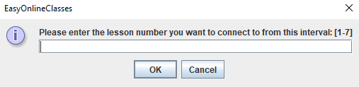
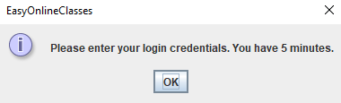
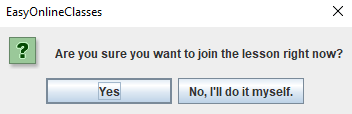
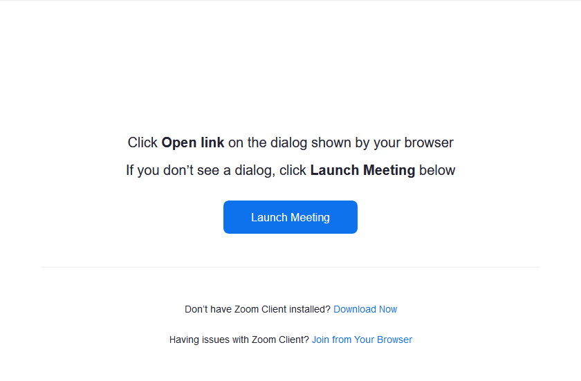

# EasyOnlineClasses
EasyOnlineClasses is a fully-automated software written in Java *(also called a bot)* mainly made for getting the Meet/Zoom link for online classes in https://studii.md. It is a bot that automatically will refresh the lesson page for you until he sees the link for the 
lesson you selected and will connect to it.

Software is currently limited to **Google Chrome** and **Windows 10** only.

# Instructions (wrapped):
1. Download/Update Java from https://www.java.com/en/download/
2. Make sure you have Google Chrome installed and updated.
3. [Download the latest version of the software.](https://github.com/Dimagreg/EasyOnlineClasses/releases)
4. Unzip the folder and run EasyOnlineClasses.exe.
5. Follow the message boxes.
*(More information in README.txt)*

# How it works?
The software is based on Selenium library that interacts with browser in human-like behaviour. The browser used is a fresh incognito Google Chrome.
On startup a message box appears asking the following:



After the user inputs the correct number, an automated chrome instance will be created where the bot will navigate through https://studii.md to the login page if it is the first launch of the software and the user is informed with the following message box:



Pressing Ok button will initiate a 5 minutes timer and the user will pass the Google Accounts login credentials **MANUALLY** due to security reasons. After the successful login, the software will parse the cookies that will be saved locally in the cookies folder. If the time runs out, the application will shutdown.
*NOTE!* Passing the login credentials is an **ONE TIME ACTION** which is required only on the first launch.

Based on today's system date, the bot will search for the lesson box with the index passed by the user and will open the lesson container where 2 <span> tags are located.


The possible link is located in one of these 2 <span> tags. The bot will check both tags for a link and in case of failure will refresh the page. The loop repeats every 5 seconds until the link is found or the browser is closed by the user.
  
If the valid Google Meet or Zoom link is found and also respecting the schedule*, the bot will connect to the online lesson.

1. In case it is a Google Meet link the user is not required to pass the login once again due to existing cookies in the session. The bot will turn off the microphone, the camera and will ask the user with the following message box:



The bot will wait for user interaction and will **not** join the lesson without user confirmation. After joining the lesson a 120 minutes timer will start. The browser will close after the timeout or anytime if the user closes the window.

2. In case of a Zoom link the Zoom page is loaded where the user will launch the zoom manually by pressing the "Launch Meeting" button. The browser will shutdown in 5 minutes or can be closed by the user.



Zoom is not automated due to the limits of Selenium Library that does not extend outside html pages.

* **,also respecting the schedule...** - because some links are posted way earlier than expected and the user does not want to connect to the lesson 20 minutes before its start, the bot will calculate the time it is supposed to wait before joining the lesson. This time is based on the school schedule and at the time of speaking it is hard-coded in the code. It looks like this:

```java
   // -5 minutes
        String firstLesson = "08-25-00";
        String secondLesson = "09-20-00";
        String thirdLesson = "10-15-00";
        String fourthLesson = "11-20-00";
        String fifthLesson = "12-25-00";
        String sixthLesson = "13-20-00";
        String seventhLesson = "14-10-00";
```

# Contribute
You can contribute to this project by testing and requesting any useful features [here](https://github.com/Dimagreg/EasyOnlineClasses/issues).
